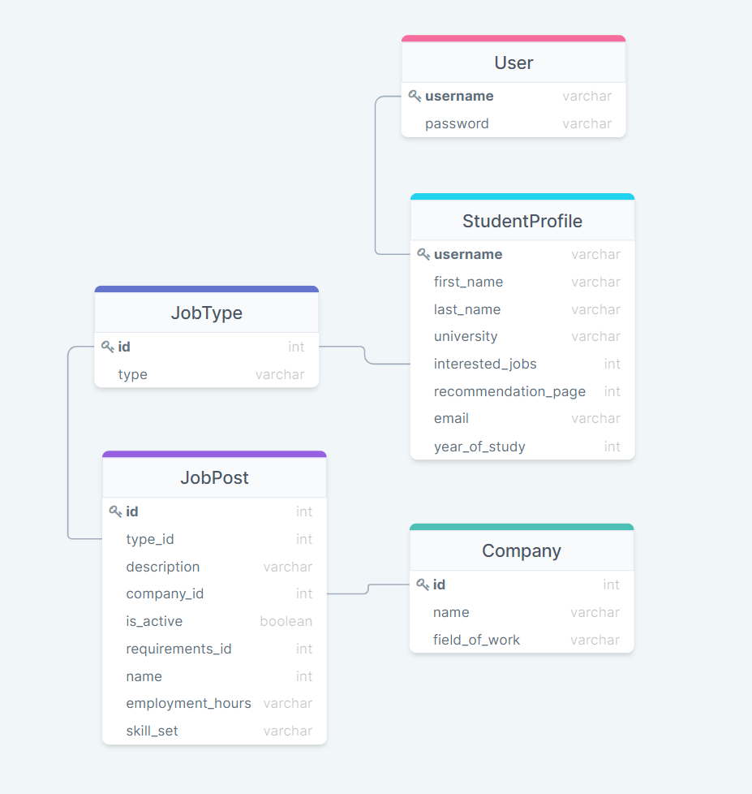
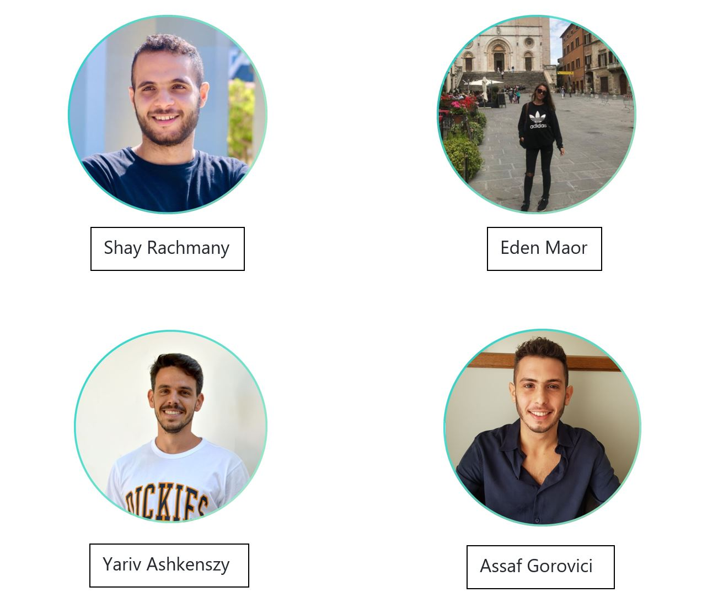

# Side-Hustle

<!-- TABLE OF CONTENTS -->

  
Table of Contents

  <ol>
    <li>
      <a href="#about-the-project">About The Project</a>
      <ul>
        <li><a href="#the-features">The Features</a></li>
      </ul>
      <ul>
        <li><a href="#built-with">Built With</a></li>
      </ul>
    </li>
    <li>
      <a href="#getting-started">Getting Started</a>
    </li>
    <li><a href="#contributing">Contributing</a></li>
    <li><a href="#license">License</a></li>
    <li><a href="#contact">Contact</a></li>
  </ol>

<!-- ABOUT THE PROJECT -->
## About The Project

### As part of the student community we feel there is a shortage of jobs for students, so we decided to build Side-Hustle (a platform for finding part time jobs for students).

(<a href="#top">back to top</a>)

### The features

The Feature Content

(<a href="#top">back to top</a>)

### Built With

major frameworks/libraries used to bootstrap our project :

* [React.js](https://reactjs.org/)
* [Bootstrap](https://getbootstrap.com)

(<a href="#top">back to top</a>)

# ERD

<!-- GETTING STARTED -->
## Getting Started

The Getting Started Content

(<a href="#top">back to top</a>)

<!-- CONTRIBUTING -->
## Contributing

Contributions are what make the open source community such an amazing place to learn, inspire, and create. Any contributions you make are **greatly appreciated**.

If you have a suggestion that would make this better, please fork the repo and create a pull request. You can also simply open an issue with the tag "enhancement".
Don't forget to give the project a star! Thanks again!

1. Fork the Project
2. Create your Feature Branch (`git checkout -b feature/Feature`)
3. Commit your Changes (`git commit -m 'Add some Feature'`)
4. Push to the Branch (`git push origin feature/Feature`)
5. Open a Pull Request

(<a href="#top">back to top</a>)

<!-- LICENSE -->
## License

Distributed under the MIT License. 

(<a href="#top">back to top</a>)

# The Team

<!-- CONTACT -->
## Contact

Eden Maor - (https://github.com/edenmaor) 

Assaf Gorovici - (https://github.com/assafg95) 

Shay Rachmany - (https://github.com/shayakrach) 

Yariv Ashkenszy - (https://github.com/AshkenYariv) 

Project Link: [https://github.com/redhat-beyond/Side-Hustle](https://github.com/redhat-beyond/Side-Hustle)

(<a href="#top">back to top</a>)

